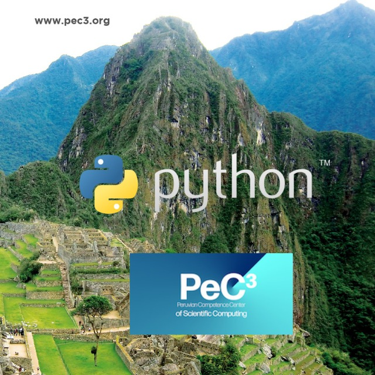

# Taller de Python para la computación científica

Python es un lenguaje de programaci'on.
Permite la.
Para detalles de Python y una biblioteca,
vea [python documentaci'on]().

Este taller tiene los siguientes objetivos:

* Enseñar a usar UM-Bridge.
* Iniciar nuevas colaboraciones entre UQ y expertos en modelos.
* Avanzar en el ecosistema de software de UQ a través de interfaces comunes,
  puntos de referencia unificados y acceso a HPC basado en la nube.

## Organizadores

* Carlos Aznarán [caznaranl@uni.pe](mailto:caznaranl@uni.pe)
* Alessandri Canchoa [canchoa@lamolina.edu.pe](mailto:canchoa@lamolina.edu.pe)

## Hora y ubicación

El taller se llevará a cabo en línea y durará cuatro días:
* Domingo, 6 de noviembre, 08:00 - 09:30 GMT -5
* Domingo, 12 de noviembre, 08:00 - 09:30 GMT -5
* Domingo, 20 de noviembre, 08:00 - 09:30 GMT -5
* Domingo, 27 de noviembre, 08:00 - 09:30 GMT -5

## Inscripción

La inscripción está disponible hasta el martes 1 de noviembre a
través del [formulario de inscripción]().

El límite es de 20 participantes.
En caso de llegar al límite, el registro se cerrará anticipadamente.

## Prerequisitos

Para los ejercicios practicos, necesitaras una instalaci'on de
* Ipython (disponible en [extra](https://archlinux.org))
* Python

## Cronograma

### Domingo, 6 de noviembre

| Time          | Session                                                                  |
| ------------- | ------------------------------------------------------------------------ |
| 8:00 - 8:45   | Talk: Introduction to Arch Linux                                         |
| 8:45 - 9:00   | Coffee break                                                             |
| 9:00 - 9:30   | Practical: Exploring bash                                                |

### Domingo, 13 de noviembre

| Time          | Session                                     |
| ------------- | ------------------------------------------- |
| 8:00 - 8:45   | Talk: Plotting                              |
| 8:45 - 9:00   | Coffee break                                |
| 9:00 - 9:30   | Practical: Proyectos                        |
